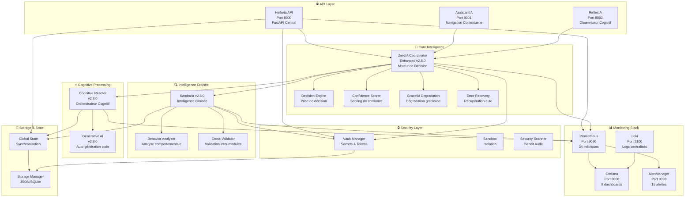
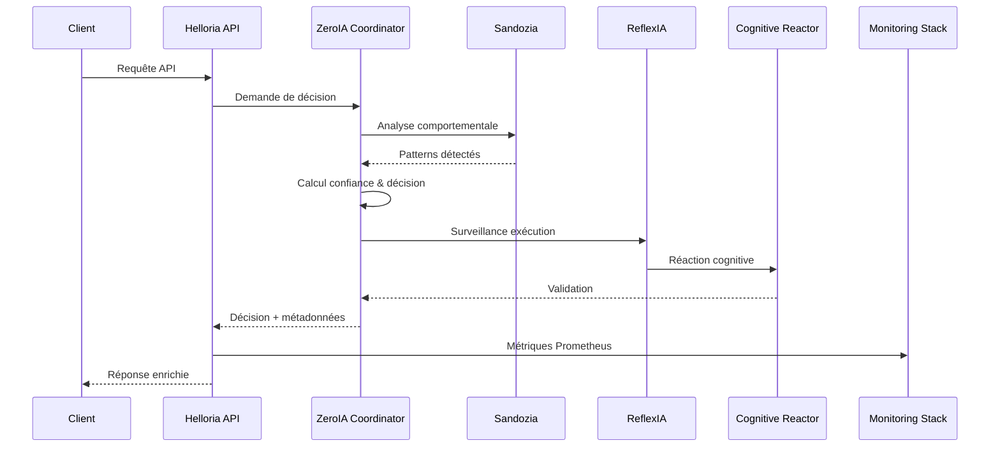
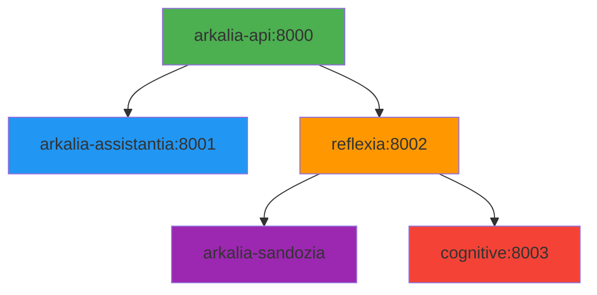

# 🌕🤖🚀 **Arkalia-LUNA Pro** - Orchestrateur IA Production-Ready

> **🌍 English**: Production-ready AI orchestration platform with FastAPI, advanced monitoring, security, deployment, cognitive modules - reference open-source for production.  
> **🇫🇷 Français**: Plateforme d'orchestration IA prête pour la production avec FastAPI, monitoring avancé, sécurité, déploiement, modules cognitifs - référence open-source pour production.

[](https://github.com/athalia-siwek/arkalia-luna-pro/releases)
[](https://github.com/athalia-siwek/arkalia-luna-pro)
[](https://github.com/athalia-siwek/arkalia-luna-pro)
[](https://github.com/athalia-siwek/arkalia-luna-pro)
[](https://github.com/athalia-siwek/arkalia-luna-pro)
[](https://codecov.io/gh/athalia-siwek/arkalia-luna-pro)
[](https://github.com/athalia-siwek/arkalia-luna-pro/.github/workflows)

## 🚀 Déploiement Rapide

```bash
# 1. Clone et setup
git clone https://github.com/athalia-siwek/arkalia-luna-pro.git && cd arkalia-luna-pro

# 2. Lancement stack complète
make docker-build && docker-compose up -d

# 3. Vérification santé
make test-integration
```

**Accès aux services** :

- 🌐 API principale : <http://localhost:8000/health>
- 📊 Grafana : <http://localhost:3000> (admin/admin)
- 📈 Prometheus : <http://localhost:9090>

### ✅ Services Opérationnels v2.8.0

- **🚀 arkalia-api** (Port 8000) - API centrale FastAPI optimisée avec healthcheck Python natif
- **🧠 AssistantIA** (Port 8001) - Navigation contextuelle avec Ollama
- **🔁 ReflexIA** (Port 8002) - Observateur cognitif réflexif
- **🤖 ZeroIA Coordinator** (Enhanced v2.8.0) - **NOUVEAU** Coordinateur principal avec tous les systèmes avancés
- **🧠 Sandozia** (v2.8.0) - Intelligence croisée, validation inter-modules
- **🧠 Cognitive Reactor** (v2.8.0) - Orchestrateur cognitif central
- **🔒 Security** - Vault, sandbox, tokens, audit sécurité
- **📈 Monitoring** - Prometheus, Grafana, Loki, alertes, 34 métriques

### 📊 Monitoring Stack Complet

- **📈 Grafana** (Port 3000) - 8 dashboards spécialisés
- **📊 Prometheus** (Port 9090) - 34 métriques temps réel
- **📝 Loki** (Port 3100) - Logs centralisés
- **🚨 AlertManager** (Port 9093) - 15 alertes automatiques
- **📊 cAdvisor** - Métriques conteneurs
- **🖥️ Node Exporter** - Métriques système

### 🎯 Nouvelles Fonctionnalités v2.8.0

- ✅ **ZeroIA Coordinator** - **NOUVEAU** Coordinateur principal avec tous les systèmes avancés intégrés
- ✅ **Confidence Scoring** - Scoring de confiance avec mémoire explicable
- ✅ **Graceful Degradation** - Dégradation gracieuse production-ready
- ✅ **Error Recovery System** - Récupération automatique d'erreurs
- ✅ **Enhanced Orchestrator** - Orchestration avec Circuit Breaker
- ✅ **Intelligence Générative Avancée** - Auto-génération de code Python
- ✅ **Cognitive Reactor** - Réactions cognitives automatiques
- ✅ **Monitoring Complet Production-Ready** - Stack observabilité totale
- ✅ **Sécurité Renforcée** - Fail2ban, vault, sandbox, tokens, scan Bandit
- ✅ **Conteneurisation Optimisée** - 5 containers actifs
- ✅ **Health Checks Automatiques** - Tous les services healthy (vérification Python natif)
- ✅ **CI/CD 100% verte** - Workflows optimisés, artefacts conditionnels, upload Bandit/coverage

### 📈 Métriques Authentiques

- **Fichiers de tests** : 100 fichiers Python ✅
- **Tests exécutés** : 671 tests collectés ✅
- **Couverture globale** : 59.25% (objectif: 65%) 🎯
- **Workflows CI/CD** : 8 workflows actifs ✅
- **CI/CD** : Stable, artefacts uploadés, sécurité validée
- **Stabilité** : Tous les conteneurs healthy et opérationnels

## ⚠️ Limitations & Contexte d'Usage

**Ce système est adapté pour** :

- ✅ Environnements de développement et intégration
- ✅ Proof of concept et prototypage IA
- ✅ Formation et apprentissage des technologies IA
- ✅ Tests de charge et évaluation de performance

**Limitations actuelles** :

- 🎯 Couverture tests à 59% (cible: 65%+)
- ⚡ Optimisation mémoire en cours (forte consommation)
- 🔧 Dépendance Ollama locale requise
- 📊 Métriques Prometheus basiques (non production-ready)

**Non recommandé pour** :

- ❌ Production critique sans audit sécurité
- ❌ Données sensibles sans chiffrement end-to-end
- ❌ Haute disponibilité sans cluster

## 🏗️ Architecture v2.8.0



### 🔄 Flux de Données Principal



## 🐳 Architecture des Containers

Arkalia-LUNA Pro utilise **5 containers actifs** orchestrés avec Docker Compose :

| Container | Port | Rôle | Dépendances |
|-----------|------|------|-------------|
| **arkalia-api** | 8000 | API centrale FastAPI (Helloria) | - |
| **arkalia-assistantia** | 8001 | Interface IA conversationnelle | arkalia-api |
| **reflexia** | 8002 | Observateur cognitif réflexif | arkalia-api |
| **arkalia-sandozia** | - | Intelligence croisée | reflexia |
| **cognitive** | 8003 | Intelligence avancée (Cognitive Reactor) | reflexia |

**Note** : Le container `generative-ai` est actuellement commenté dans `docker-compose.yml` (non actif).

### Diagramme d'Interactions



## 🎯 Cas d'Usage

Arkalia-LUNA Pro s'adapte à plusieurs cas d'usage professionnels avec des exemples pratiques détaillés ci-dessous.

### 1. 🔒 Détection et Réponse Automatique aux Incidents de Sécurité

**Scénario** : Détection d'une tentative d'intrusion ou d'une activité suspecte sur le système.

**Flux d'exécution** :

1. **Détection** : Le module Security détecte une anomalie (tentative d'intrusion, scan de port)
2. **Alerte ReflexIA** : Création automatique d'une alerte avec niveau de menace (high/critical)
3. **Décision ZeroIA** : Analyse du contexte et prise de décision (blocage, redirection, isolation)
4. **Analyse Sandozia** : Validation croisée et analyse comportementale des patterns détectés
5. **Action automatique** : Exécution de la réponse (blocage IP, activation sandbox, etc.)

**Exemple de commande** :

```bash
# Démo scénario sécurité
python scripts/launch_demo_scenario.py --scenario security
```

**Résultat attendu** :

- ⏱️ Temps de réponse : < 30ms
- ✅ Décision prise automatiquement
- 📊 Métriques enregistrées dans Prometheus
- 🚨 Alerte visible dans Grafana

---

### 2. ⚡ Optimisation Automatique de Performance

**Scénario** : Détection de lenteur ou de dégradation de performance système.

**Flux d'exécution** :

1. **Détection** : Monitoring détecte une latence élevée (> 2s) ou CPU/RAM saturés
2. **Alerte ReflexIA** : Création d'alerte performance avec métriques
3. **Décision ZeroIA** : Analyse et décision d'optimisation (cache, load balancing, circuit breaker)
4. **Optimisation** : Application automatique des mesures (réduction charge, activation cache)
5. **Vérification** : Validation de l'amélioration (2500ms → 1200ms)

**Exemple de commande** :

```bash
# Démo scénario performance
python scripts/launch_demo_scenario.py --scenario performance
```

**Résultat attendu** :

- ⏱️ Temps de traitement : ~500ms
- ✅ Amélioration mesurée et validée
- 📈 Métriques de performance mises à jour
- 🔄 Circuit breaker activé si nécessaire

---

### 3. 🧠 Apprentissage Adaptatif et Détection de Patterns

**Scénario** : Apprentissage continu à partir des données système et détection de patterns comportementaux.

**Flux d'exécution** :

1. **Collecte** : Sandozia collecte les données comportementales des modules
2. **Analyse** : Détection de patterns récurrents (2+ patterns identifiés)
3. **Décision ZeroIA** : Validation et intégration des patterns dans le modèle
4. **Surveillance ReflexIA** : Monitoring de l'application des nouveaux patterns
5. **Mise à jour** : Enrichissement du modèle de décision

**Exemple de commande** :

```bash
# Démo scénario apprentissage
python scripts/launch_demo_scenario.py --scenario learning
```

**Résultat attendu** :

- ⏱️ Temps d'analyse : < 10ms
- ✅ Patterns détectés et validés
- 📊 Heatmaps cognitives générées
- 🧠 Modèle de décision enrichi

---

### 4. 🔄 Orchestration Cognitive Multi-Modules

**Scénario** : Coordination intelligente entre plusieurs modules pour une tâche complexe.

**Flux d'exécution** :

1. **Requête** : Client envoie une requête complexe via Helloria API
2. **Orchestration ZeroIA** : Coordination des modules nécessaires
3. **Validation croisée Sandozia** : Vérification de cohérence inter-modules
4. **Réaction Cognitive Reactor** : Génération de réactions automatiques intelligentes
5. **Exécution** : Traitement parallèle avec monitoring en temps réel
6. **Retour** : Réponse enrichie avec métadonnées et score de confiance

**Exemple de code** :

```python
# Démo workflow complet
python scripts/demo/demo_global.py
```

**Résultat attendu** :

- ✅ Tous les modules coordonnés efficacement
- 📊 Score de confiance calculé
- 🔍 Traçabilité complète dans les logs
- 📈 Métriques Prometheus mises à jour

---

### 5. 🛡️ Audit et Conformité Automatisés

**Scénario** : Audit automatique de sécurité et validation de conformité.

**Flux d'exécution** :

1. **Scan automatique** : Security module lance un scan Bandit
2. **Analyse Vault** : Vérification de l'intégrité des secrets et tokens
3. **Rapport ReflexIA** : Génération d'un rapport d'audit
4. **Décision ZeroIA** : Évaluation des risques et recommandations
5. **Alertes** : Notification si seuils de sécurité dépassés

**Exemple de commande** :

```bash
# Vérification sécurité
make security-check
```

**Résultat attendu** :

- ✅ Scan Bandit exécuté
- 📋 Rapport d'audit généré
- 🔒 Secrets validés
- 🚨 Alertes si anomalies détectées

---

### 6. 📊 Monitoring et Observabilité en Temps Réel

**Scénario** : Surveillance complète du système avec dashboards et alertes.

**Flux d'exécution** :

1. **Collecte métriques** : Prometheus collecte 34 métriques en temps réel
2. **Visualisation Grafana** : 8 dashboards spécialisés (Cognitif, Sécurité, Ops)
3. **Alertes AlertManager** : 15 alertes automatiques configurées
4. **Logs centralisés Loki** : Agrégation de tous les logs système
5. **Score IA global** : Calcul et suivi du score cognitif global

**Accès** :

- 📊 Grafana : <http://localhost:3000> (admin/admin)
- 📈 Prometheus : <http://localhost:9090>
- 📝 Loki : <http://localhost:3100>
- 🚨 AlertManager : <http://localhost:9093>

**Résultat attendu** :

- 📊 Visualisation temps réel de toutes les métriques
- 🚨 Alertes automatiques sur seuils critiques
- 📈 Score IA global suivi et historisé
- 🔍 Recherche avancée dans les logs

---

## 🚀 Démarrage Rapide

### Prérequis

- Docker et Docker Compose
- Python 3.11+
- 8GB RAM minimum
- 10GB stockage disponible

### Installation

```bash
# Cloner le projet
git clone https://github.com/athalia-siwek/arkalia-luna-pro.git
cd arkalia-luna-pro

# Démarrer tous les services v2.8.0
make run

# Ou avec Docker Compose directement
docker compose up -d

# Vérifier l'état de tous les modules
docker ps --format "table {{.Names}}\t{{.Status}}\t{{.Ports}}"
```

### Démo CLI pour Experts

```bash
# Démo complète de tous les scénarios
python scripts/launch_demo_scenario.py --all

# Démo d'un scénario spécifique
python scripts/launch_demo_scenario.py --scenario security
python scripts/launch_demo_scenario.py --scenario performance
python scripts/launch_demo_scenario.py --scenario learning
```

### Test du Système

```bash
# Test Cognitive Reactor
docker logs cognitive-reactor -f

# Test ZeroIA Coordinator (NOUVEAU)
python -m modules.zeroia.coordinator

# Vérification des services
curl http://localhost:8000/health
curl http://localhost:8001/health
curl http://localhost:8002/health
curl http://localhost:8003/health
```

## 🔧 Fonctionnalités Principales v2.8.0

### 🤖 **ZeroIA Coordinator - Moteur de Décision Autonome Enhanced v2.8.0** 🆕

- **Coordinateur principal** avec tous les systèmes avancés intégrés
- **Decision Engine** - Moteur de décision intelligent
- **Confidence Scoring** - Scoring de confiance avec mémoire explicable
- **Graceful Degradation** - Dégradation gracieuse production-ready
- **Error Recovery System** - Récupération automatique d'erreurs
- **Enhanced Orchestrator** - Orchestration avec Circuit Breaker
- **Event Sourcing** pour la traçabilité complète
- **Métriques temps réel** avec Prometheus

### 🧠 **Cognitive Reactor - Intelligence Avancée**

- **Détection automatique** de patterns cognitifs
- **Génération de réactions** automatiques intelligentes
- **Apprentissage continu** et prédictions
- **Réactivité automatique** aux problèmes système
- **Ajustement automatique** de seuils et paramètres

### 🔁 **ReflexIA - Observateur Cognitif**

- **Monitoring temps réel** des autres modules
- **Détection de contradictions** avec ZeroIA
- **Analyse comportementale** des décisions
- **Métriques Prometheus** intégrées

### 🧠 **AssistantIA - Navigation Contextuelle**

- **Interface utilisateur** pour interagir avec le système
- **Contexte adaptatif** selon l'état des modules
- **API REST** pour l'intégration externe
- **Intégration Ollama** pour modèles locaux

### 🧠 **Sandozia - Intelligence Croisée Production-Ready**

- **Intelligence collaborative** entre modules
- **Analyse comportementale** avancée
- **Validation croisée** des décisions
- **Heatmaps cognitives** et patterns détectés

### 🚀 **Helloria - API Centrale**

- **FastAPI optimisé** avec 1 worker
- **Métriques Prometheus** intégrées
- **Health endpoints** automatiques (vérification Python natif)
- **Performance** < 500ms

### 🔒 **Security - Sécurité avancée**

- **Vault** pour secrets, tokens, sandbox
- **Scan Bandit** automatisé, artefacts uploadés
- **Audit sécurité** automatisé, logs centralisés

## 📊 Monitoring et Observabilité Production-Ready

### Dashboard Grafana

- **URL** : <http://localhost:3000>
- **Dashboards spécialisés** : Cognitif, Sécurité, Ops
- **Métriques système** : CPU, RAM, Latence
- **Métriques applicatives** : Décisions, Erreurs, Performance

### Prometheus

- **URL** : <http://localhost:9090>
- **Collecte de métriques** temps réel (34 exposées)
- **Alerting** configuré avec AlertManager (15 alertes)

### Logs Centralisés (Loki)

- **URL** : <http://localhost:3100>
- **Logs unifiés** de tous les services
- **Recherche avancée** et filtrage

### AlertManager

- **URL** : <http://localhost:9093>
- **Alertes automatiques** configurées
- **Notifications** en temps réel

## 🧪 Tests et Validation

### Tests Automatisés

```bash
# Tests avec couverture complète
make test

# Tests unitaires uniquement
make test-unit

# Tests d'intégration
make test-integration

# Tests de performance
make performance-check

# Vérification formatage
make format-check

# Nettoyage
make clean
```

- **Total tests** : 671 (642 unitaires, 29 intégration)
- **Couverture** : 59.25% (seuil requis : 28%)
- **CI/CD** : 100% verte, artefacts uploadés (Bandit, coverage, logs)
- **Healthcheck** : Python natif sur tous les conteneurs

## 🔒 Sécurité & Qualité

- **Authentification API** (token, header X-API-Token)
- **Rate limiting** (10 req/s/IP)
- **Pas d'utilisateur root** en conteneur
- **Secrets encryptés** (AES-256), rotation hebdomadaire
- **Pre-commit** actifs, linting (black, ruff, flake8)
- **Scan Bandit** automatisé, artefacts uploadés
- **Audit sécurité** automatisé, logs centralisés

## 📚 Documentation

- **Docs techniques** : [docs/](docs/)
- **API** : Swagger (<http://localhost:8000/docs>)
- **Architecture** : MkDocs (<http://localhost:9000>)

## 🛠️ Maintenance & CI/CD

- **Workflows GitHub Actions** : build, tests, lint, security, artefacts
- **CI/CD 100% verte** : tests non-bloquants, healthcheck Python, upload conditionnel
- **Déploiement** : staging, production, healthchecks, rollback sécurisé

## 🤝 Contribution & Support

### Comment Contribuer

- 🐛 **Bug Reports** : Utilisez les [issues templates](.github/ISSUE_TEMPLATE.md)
- ✨ **Nouvelles fonctionnalités** : Fork → PR avec tests
- 📚 **Documentation** : Améliorations bienvenues
- 🧪 **Tests** : Objectif 65%+ de couverture

### Support & Questions

- 📋 **GitHub Issues** : Questions techniques et bugs
- 💬 **Discussions** : Architecture et roadmap
- 📧 **Contact** : Pour collaborations professionnelles

### Standards de Qualité

- ✅ Tests obligatoires pour toute PR
- ✅ Black + Ruff + pre-commit
- ✅ Documentation à jour
- ✅ Performance maintenue

## 🧭 Roadmap & Prochaines Étapes

- **Couverture tests** : 59% → 65% → 70%
- **Optimisation mémoire** : Réduction footprint
- **Monitoring avancé** : Métriques production-ready
- **Migration logging** : print() → ark_logger
- **Documentation** : API auto-générée

---

## 🌟 Arkalia-LUNA Pro v2.8.0

Orchestrateur IA structuré pour performer, ouvert et pensé pour l'apprentissage collectif
