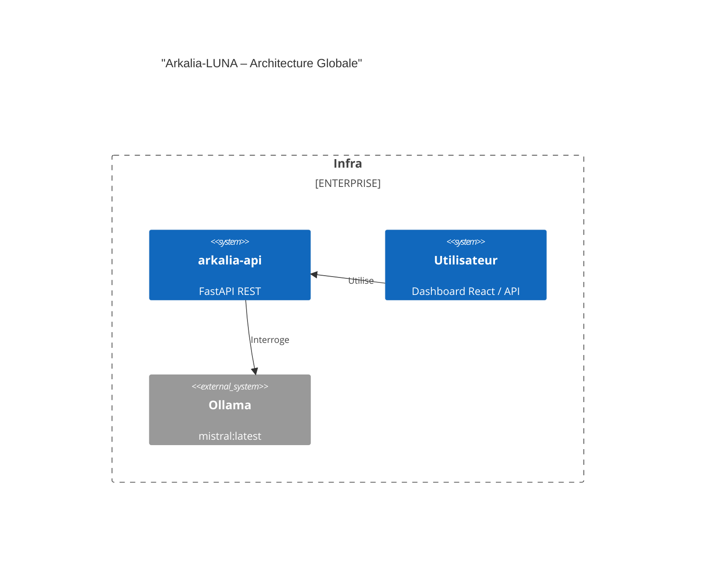

# 📘 Cahier des Charges – Arkalia-LUNA Pro (v4.0+)

## 1. 🌟 Objectifs du Projet

### 🔹 Vision Progressive et Réaliste

Le développement d'Arkalia suit une approche **progressive, modulaire et sécurisée**, compatible avec les contraintes d'un développeur solo. Le but n'est pas d'implémenter tout d'un coup, mais d'avancer **itérativement**, en garantissant la stabilité à chaque étape.

### 🔹 Court Terme (1–3 mois)

* Stabiliser 100 % des conteneurs Docker (healthchecks inclus)
* Refactorer les modules critiques (`reason_loop`, `snapshot`, `security.py`) selon SOLID
* Implémenter une authentification API (JWT + rate limiting)
* Réduire le temps de réponse de MkDocs à < 1s (via cache Redis)
* Déployer CI/CD locale complète (pytest, black, ruff, GitHub Actions avec `act`)
* **NOUVEAU** : Renforcer la couverture de tests des modules critiques (reflexia, zeroia, reason_loop_enhanced.py)

### 🔹 Moyen Terme (3–6 mois)

* Migration progressive vers architecture hexagonale (api/, domain/, use_cases/, infra/)
* Intégrer OpenTelemetry (tracing distribué)
* Finaliser les interactions ZeroIA ↔ ReflexIA ↔ Sandozia
* Créer un environnement staging avec rollback sécurisé
* **NOUVEAU** : Migration ciblée print() → ark_logger (tests/ et generated/ uniquement)

### 🔹 Long Terme (6–12 mois)

* Déploiement Cloud (AWS/GCP via Terraform), auto-scaling, CDN
* Intégration de LLM avancés (Claude, GPT-4) dans AssistantIA
* Auto-apprentissage par feedback utilisateur (ZeroIA v2)
* Audit sécurité externe (ISO 27001, RGPD), sandbox cognitive
* **NOUVEAU** : Migration complète print() → ark_logger (après couverture tests > 90%)

---

## 2. 🌐 Contexte du Projet

Arkalia-LUNA est un système cognitif IA auto-réparateur, conteneurisé, piloté par API REST (FastAPI) et disposant d'une interface SPA (React).

**Cibles** :

* Développeurs IA, DevOps cognitifs
* Systèmes critiques, laboratoire R&D, observabilité avancée

---

## 3. 🧱 Architecture Actuelle

* Conteneurs actifs : 5 (ZeroIA, ReflexIA, Sandozia, AssistantIA, Cognitive Reactor)
* API REST : FastAPI (`arkalia-api`)
* LLM local : mistral:latest (Ollama)
* Monitoring : Prometheus, Grafana, Loki, cadvisor
* Frontend : React (Vite + Tailwind)
* Documentation : MkDocs (Material Theme)
* CI/CD : GitHub Actions, pytest, coverage, pre-commit, `act`



---

## 4. 📏 Règles de Codage & Bonnes Pratiques

### 🔹 Principes Architecturaux

* Clean Architecture stricte : `core/`, `domain/`, `infra/`, `interfaces/`
* SOLID appliqué sur tous les modules IA
* Domain Driven Design (DDD) en phase d'introduction

### 🔹 SOLID

| Principe | Exigence                        | Exemple                               |
| -------- | ------------------------------- | ------------------------------------- |
| S        | Une classe = une responsabilité | `Reasoner`, `ErrorDetector`           |
| O        | Ouvert à extension              | `on_reasoning_complete()`             |
| L        | Substituabilité                 | `IModule` → `ZeroIA`, `Reflexia`      |
| I        | Interfaces fines                | `ILogger`, `IScorer`                  |
| D        | Inversion d'injection           | `def __init__(self, scorer: IScorer)` |

### 🔹 Conventions

* PEP8, ruff, black
* **RÈGLE RÉVISÉE** : `print()` → `ark_logger` (migration progressive et sécurisée)
* Variables explicites : `score_final`, `module_state`
* Tests avec `pytest`, `pytest-mock`, `--cov`, seuil > 28% (actuellement 59.25%)

### 🔹 **NOUVELLES RÈGLES - Migration print() → logging**

#### 🚫 **ZONES INTERDITES (Ne jamais toucher)**

* `helloria/__init__.py` - Messages de démarrage critiques
* `reflexia/logic/main_loop*.py` - Boucles vitales et monitoring
* `zeroia/reason_loop*.py` - Logique de décision critique
* `print(json.dumps(...))` - Communication inter-process

#### ✅ **ZONES AUTORISÉES (Migration manuelle uniquement)**

* `tests/` - Tests unitaires et d'intégration
* `modules/*/generated/` - Code généré automatiquement
* Messages de debug simples (`print("debug")` → `ark_logger.debug("debug")`)

#### 🔒 **RÈGLES DE SÉCURITÉ**

* **Aucune automatisation** de migration print() → logging
* **Test obligatoire** après chaque modification
* **Sauvegarde** avant chaque changement
* **Validation** par tests unitaires complets

### 🔹 Architecture des tests

```text
tests/
├── unit/
├── integration/
├── chaos/
├── performance/
├── security/
├── matrix/
```

#### Structure des tests

Aucun test en dehors de ce dossier. Convention : `test_*.py`, markers `@pytest.mark.unit`, etc.

---

## 4bis. 🛡️ Méthodologie & Discipline de Travail Arkalia

### 🔄 **CI/CD Stricte & Workflow Git**

#### **Exigences CI/CD (OBLIGATOIRES)**

* **Tout commit doit passer la CI** : tests unitaires + intégration, linting (black, ruff), build Docker, healthcheck natif Python
* **Seuil de couverture bloquant** : minimum 28% (actuellement 59.25% - largement dépassé)
* **671 tests passés, 0 échec** : validation systématique avant merge
* **Artefacts conditionnels** : upload automatique des rapports de couverture et logs
* **Healthcheck natif** : validation de l'API arkalia avec urllib Python (pas de curl)
* **Pre-commit hooks** : validation automatique avant commit

#### **Workflow Git Professionnel**

* **Branches courtes** : feature branches limitées à 1-2 jours max
* **Pull Request systématique** : même pour les corrections mineures
* **Squash & rebase** : historique Git propre et linéaire
* **Commits signés** : GPG obligatoire pour les releases
* **Tags versionnés** : bumpver automatique, tags explicites
* **Validation croisée** : relecture obligatoire pour tout changement critique

### 🧪 **Tests & Qualité de Code**

#### **Exigences de Tests (CRITIQUES)**

* **100% des features critiques testées** : modules zeroia, reflexia, sandozia, security
* **Tests E2E** : validation complète des workflows
* **Tests d'intégration** : validation des interactions inter-modules
* **Tests de non-régression** : validation automatique après chaque modification
* **Tests de sécurité** : validation des vulnérabilités potentielles
* **Tests de performance** : validation des seuils de latence et de charge
* **Tests de chaos** : validation de la résilience du système

#### **Qualité de Code (OBLIGATOIRE)**

* **Formatage automatique** : black, ruff, pre-commit hooks
* **PEP8 strict** : pas d'écart sans justification documentée
* **Pas de code mort** : suppression systématique des imports et fonctions inutilisés
* **Pas de TODO non justifié** : tous les TODO doivent avoir un ticket associé
* **Refactoring continu** : dette technique traçable et planifiée
* **Documentation inline** : docstrings pour toutes les fonctions publiques

### 📚 **Documentation & Reporting**

#### **Exigences de Documentation (OBLIGATOIRES)**

* **Chaque module critique documenté** : README.md, docstrings, exemples d'usage
* **Badges à jour** : couverture, CI, version, licence
* **Changelog maintenu** : historique des changements et breaking changes
* **Reporting automatique** : génération automatique des rapports de couverture
* **Statuts visibles** : dashboard de santé du projet accessible
* **Documentation technique** : architecture, API, déploiement, troubleshooting

#### **Reporting & Traçabilité**

* **Logs centralisés** : tous les modules loggent vers un système centralisé
* **Métriques Prometheus** : monitoring en temps réel de tous les modules
* **Alertes automatiques** : notification en cas de dégradation
* **Artefacts de build** : conservation des logs et rapports de build
* **Historique des déploiements** : traçabilité complète des releases

### 🔐 **Sécurité & Conformité**

#### **Exigences de Sécurité (CRITIQUES)**

* **Audit régulier** : scan de vulnérabilités automatique
* **Pas de secrets en clair** : chiffrement AES-256 obligatoire
* **Rotation des clés** : rotation hebdomadaire des secrets
* **User non-root** : tous les conteneurs exécutés en tant qu'utilisateur non-privilégié
* **Logs redondants** : sauvegarde des logs critiques
* **Monitoring sécurité** : détection d'intrusion et alertes
* **Conformité RGPD** : gestion des données personnelles conforme

#### **Gestion des Secrets**

* **Vault Arkalia** : gestion centralisée des secrets
* **Chiffrement en transit** : TLS obligatoire pour toutes les communications
* **Chiffrement au repos** : chiffrement des données sensibles
* **Audit des accès** : journalisation de tous les accès aux secrets

### 🧹 **Hygiène & Maintenance**

#### **Exigences d'Hygiène (OBLIGATOIRES)**

* **Suppression fichiers système** : nettoyage automatique des `.DS_Store`, `._*`
* **Nettoyage des caches** : suppression des `__pycache__`, `.pytest_cache`
* **Gestion des logs** : rotation et compression automatique
* **Nettoyage des artefacts** : suppression des artefacts obsolètes
* **Validation de l'intégrité** : checksums des fichiers critiques

#### **Maintenance Préventive**

* **Mise à jour des dépendances** : scan de vulnérabilités automatique
* **Refactoring planifié** : plan de refactoring trimestriel
* **Optimisation continue** : monitoring des performances
* **Backup automatique** : sauvegarde des données critiques

### 🔄 **Process de Migration & Validation**

#### **Exigences de Migration (CRITIQUES)**

* **Audit préalable** : analyse complète avant toute migration
* **Sauvegarde obligatoire** : backup avant toute modification critique
* **Migration manuelle uniquement** : pas d'automatisation pour les migrations critiques
* **Tests systématiques** : validation après chaque étape
* **Rollback possible** : possibilité de revenir en arrière
* **Validation croisée** : relecture par un pair (même en solo, auto-relecture)

#### **Checklist de Validation**

* [ ] Tests unitaires passent
* [ ] Tests d'intégration passent
* [ ] Couverture de code maintenue
* [ ] Documentation mise à jour
* [ ] Logs vérifiés
* [ ] Performance validée
* [ ] Sécurité vérifiée
* [ ] Artefacts générés
* [ ] CI/CD verte

### 📊 **Monitoring & Observabilité**

#### **Exigences de Monitoring (OBLIGATOIRES)**

* **Prometheus** : métriques système et applicatives
* **Grafana** : dashboards de monitoring
* **Loki** : centralisation des logs
* **Alertes** : notification en temps réel
* **Traces** : traçabilité des requêtes
* **Healthchecks** : validation de la santé des services

#### **Métriques Critiques**

* **Latence API** : < 300ms
* **Uptime** : > 99.9%
* **CPU par module** : < 80%
* **RAM par module** : < 100MB
* **Couverture de tests** : > 28% (actuellement 59.25%)

### 🚫 **Pratiques Interdites**

#### **Interdictions Absolues**

* **Migration automatique des print()** : jamais d'automatisation pour les migrations critiques
* **Commits sans tests** : tous les commits doivent passer les tests
* **Code non documenté** : pas de fonction publique sans docstring
* **Secrets en clair** : jamais de secrets dans le code ou les logs
* **User root** : jamais d'exécution en tant que root
* **TODO sans ticket** : pas de TODO sans justification et ticket
* **Code mort** : pas de code inutilisé dans le repository

#### **Pratiques à Éviter**

* **Branches longues** : éviter les branches de plus de 2 jours
* **Commits multiples** : préférer le squash pour les features
* **Documentation obsolète** : maintenir la documentation à jour
* **Tests manuels** : automatiser tous les tests possibles
* **Logs non structurés** : utiliser le logging structuré

### ✅ **Pratiques Recommandées**

#### **Bonnes Pratiques**

* **Tests en premier** : TDD pour les nouvelles fonctionnalités
* **Documentation vivante** : documentation qui évolue avec le code
* **Refactoring continu** : amélioration continue du code
* **Monitoring proactif** : détection des problèmes avant qu'ils n'impactent
* **Communication transparente** : partage des décisions et des problèmes
* **Apprentissage continu** : amélioration des pratiques basée sur les retours

---

## 5. ⚙️ Exigences Techniques

### 🔐 Sécurité

* Auth API (JWT + header `X-API-Token`)
* Rate limiting : 10 req/s/IP max (slowapi)
* Pas d'utilisateur root en conteneur (USER = `arkalia`)
* Secrets encryptés (AES-256), rotation hebdomadaire
* **NOUVEAU** : Audit print() → logging obligatoire avant déploiement

### 📊 Observabilité & Monitoring

* /metrics Prometheus par module
* Dashboards Grafana dynamiques
* Alertes notifications/mail (CPU > 80 %, ZeroIA KO, etc.)
* Tracing avec OpenTelemetry
* **NOUVEAU** : Logging structuré `ark_logger` pour tous les modules

### 🧪 Qualité

* Couverture cible : 90 %
* CI bloquante < 85 %
* Pre-commit actifs
* Docs : Swagger pour API, MkDocs pour architecture
* **NOUVEAU** : Tests obligatoires pour modules critiques (reflexia, zeroia, reason_loop)
* **CI/CD 100% verte** : 671 tests passés, 0 échec
* **Healthcheck natif** : validation Python urllib intégrée
* **Artefacts conditionnels** : upload automatique des rapports

---

## 6. 🛠️ Roadmap Technique

| Mois | Objectifs Clés                                   | Priorité |
| ---- | ------------------------------------------------ | -------- |
| 1–2  | Auth API, refactor SOLID, cache Redis            | 🔴 Haute |
| 2–3  | **NOUVEAU** : Renforcer tests modules critiques  | 🔴 Haute |
| 3–4  | CI/CD, staging, Swagger stable                   | 🔵 Moyenne |
| 4–5  | Migration ciblée print() → ark_logger (tests/)   | 🟡 Basse |
| 5–6  | Tracing OpenTelemetry, Reasoning multi-agent     | 🔵 Moyenne |
| 6–12 | Cloud (Terraform), sandbox cognitive, auto-learn | 🟢 Future |

---

## 7. 📌 Annexes

### 📂 Structure Dossier

```text
arkalia-luna/
├── api/
├── core/
├── modules/
├── docs/
├── frontend/
├── infrastructure/
├── tests/
├── scripts/
```

### 📊 KPIs Suivis

| KPI              | Cible    | État Actuel |
| ---------------- | -------- | ----------- |
| Latence API      | < 300 ms | ✅ OK       |
| Uptime           | > 99.9 % | ✅ OK       |
| CPU/Module       | < 80 %   | ✅ OK       |
| RAM/module       | < 100 MB | ✅ OK       |
| Couverture tests | > 28 %   | ✅ 59.25%   |
| CI/CD Status     | 100% verte | ✅ 671 tests passés |
| Healthcheck      | Natif Python | ✅ urllib intégré |
| Artefacts        | Conditionnels | ✅ Upload auto |

### 🔑 Exemple Auth FastAPI

```python
from fastapi import Header, HTTPException

def check_token(x_token: str = Header(...)):
    if x_token != os.getenv("ARKALIA_TOKEN"):
        raise HTTPException(status_code=403, detail="Access Denied")
```

### 🔍 **NOUVEAU - Plan de Migration print() → logging**

#### Phase 1 : Audit et Préparation (✅ Terminé)

* [x] Audit complet des print() dans modules/
* [x] Classification par criticité (HIGH/MEDIUM/LOW/EXCLUDE)
* [x] Création de `print_audit.json` pour référence

#### Phase 2 : Tests et Généré (🟡 En cours)

* [ ] Migration manuelle dans `tests/`
* [ ] Migration manuelle dans `modules/*/generated/`
* [ ] Validation par tests unitaires

#### Phase 3 : Debug Simple (⏳ Future)

* [ ] Migration des `print("debug")` → `ark_logger.debug("debug")`
* [ ] Tests systématiques après chaque modification

#### Phase 4 : Modules Critiques (⏳ Très Future)

* [ ] Migration uniquement après couverture tests > 90%
* [ ] Validation complète par tests d'intégration
* [ ] Tests de charge et de résilience

---

## 8. 🚨 **LEÇONS APPRISES - Migration print()**

### ❌ **Ce qui n'a pas fonctionné**

* Migration automatique globale
* Remplacement sans vérification des imports
* Modification des modules critiques sans tests complets

### ✅ **Ce qui fonctionne**

* Audit préalable et classification
* Migration manuelle et ciblée
* Tests systématiques après modification
* Sauvegarde avant chaque changement

### 🔐 **Règles de Sécurité Établies**

* **Jamais** de migration automatique des print()
* **Toujours** tester après modification
* **Conserver** les print() critiques (helloria, reflexia, zeroia)
* **Prioriser** la stabilité sur la perfection

---

## ✅ Rappel final : Progressivité Obligatoire

Ce cahier des charges **n'est pas un objectif à tout faire d'un coup**. Il sert à guider un développement **progressif**, propre, sans dette technique, en mode expert IA solo. Chaque étape doit être validée avant la suivante.

**Document à relire chaque trimestre** — Version : v4.2-Janvier-2025

### Dernière mise à jour

Novembre 2025

### Signatures

* 🧠 **Athalia** – Architecte IA Système
* 🔐 Responsable sécurité : …
