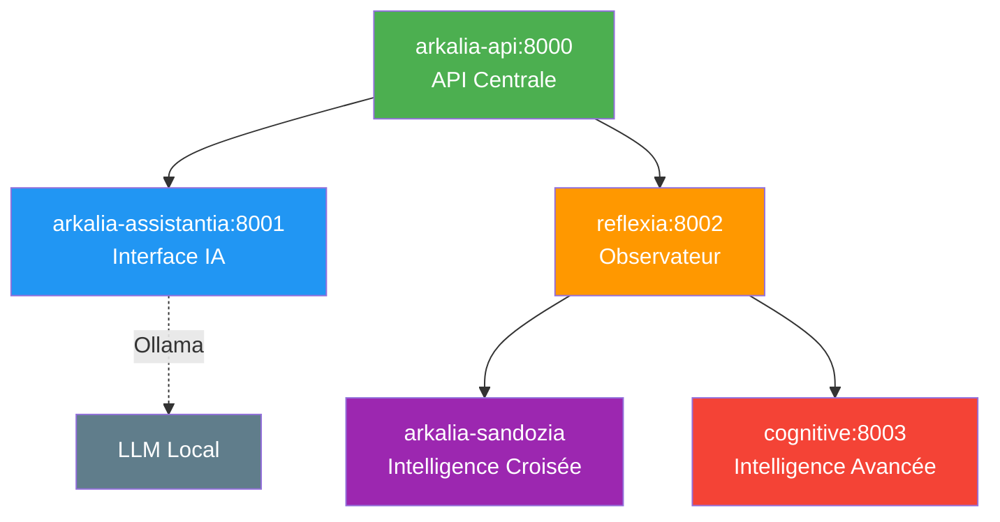

# 🐳 Architecture des Containers - Arkalia-LUNA Pro

## Dernière mise à jour

novembre 2025

---

## Vue d'Ensemble

Arkalia-LUNA Pro utilise **5 containers actifs** orchestrés avec Docker Compose pour une architecture modulaire et scalable.

---

## 📋 Liste des Containers

### 1. 🚀 arkalia-api (Port 8000)

**Rôle** : API centrale FastAPI (Helloria) - Point d'entrée principal du système

**Caractéristiques** :

- **Port** : 8000
- **Image** : Construite depuis `Dockerfile.simple`
- **Command** : `python run_arkalia_api.py`
- **Dépendances** : Aucune (container racine)
- **Ressources** : 512M RAM max, 1 CPU max
- **Healthcheck** : Socket TCP sur port 8000

**Fonctionnalités** :

- Endpoints REST pour tous les modules
- Métriques Prometheus intégrées
- Health checks automatiques
- Rate limiting et sécurité

---

### 2. 🤖 arkalia-assistantia (Port 8001)

**Rôle** : Interface IA conversationnelle avec intégration Ollama

**Caractéristiques** :

- **Port** : 8001
- **Image** : `arkalia-luna-assistantia:production`
- **Command** : `uvicorn modules.assistantia.core:app --host 0.0.0.0 --port 8001`
- **Dépendances** : `arkalia-api` (service_started)
- **Ressources** : 512M RAM max, 1 CPU max
- **Healthcheck** : Socket TCP sur port 8001

**Fonctionnalités** :

- Interface conversationnelle avec LLM local (Ollama)
- Navigation contextuelle adaptative
- API REST pour intégration externe
- Support multi-modèles (mistral, llama2, etc.)

---

### 3. 🔁 reflexia (Port 8002)

**Rôle** : Observateur cognitif réflexif - Monitoring et analyse du système

**Caractéristiques** :

- **Port** : 8002
- **Image** : Construite depuis `docker/Dockerfile.reflexia`
- **Command** : `uvicorn run_reflexia_api:app --host 0.0.0.0 --port 8002`
- **Dépendances** : `arkalia-api` (service_started)
- **Ressources** : Par défaut (512M RAM)
- **Healthcheck** : Socket TCP sur port 8002

**Fonctionnalités** :

- Monitoring temps réel des autres modules
- Détection de contradictions avec ZeroIA
- Analyse comportementale des décisions
- Métriques Prometheus intégrées

---

### 4. 🧠 arkalia-sandozia

**Rôle** : Intelligence croisée - Validation inter-modules et consensus

**Caractéristiques** :

- **Port** : Aucun (daemon interne)
- **Image** : `arkalia-luna-sandozia:optimized`
- **Command** : `python -m modules.sandozia.core.sandozia_core --start`
- **Dépendances** : `reflexia` (service_started)
- **Ressources** : 1G RAM max, 1.5 CPU max
- **Healthcheck** : Import Python du module

**Fonctionnalités** :

- Intelligence collaborative entre modules
- Validation croisée des décisions
- Analyse comportementale avancée
- Heatmaps cognitives et patterns détectés

---

### 5. 🧠 cognitive (Port 8003)

**Rôle** : Intelligence avancée (Cognitive Reactor) - Réactions automatiques intelligentes

**Caractéristiques** :

- **Port** : 8003
- **Image** : Construite depuis `docker/Dockerfile.cognitive-reactor`
- **Command** : `uvicorn run_cognitive_api:app --host 0.0.0.0 --port 8003`
- **Dépendances** : `reflexia` (service_started)
- **Ressources** : Par défaut (512M RAM)
- **Healthcheck** : Socket TCP sur port 8003

**Fonctionnalités** :

- Détection automatique de patterns cognitifs
- Génération de réactions automatiques intelligentes
- Apprentissage continu et prédictions
- Ajustement automatique de seuils et paramètres

---

## 🔄 Diagramme d'Interactions



---

## 📊 Flux de Données

### Flux Principal

1. **Requête utilisateur** → `arkalia-api` (port 8000)
2. **Traitement** → `arkalia-assistantia` (si conversation) ou modules spécialisés
3. **Monitoring** → `reflexia` observe et analyse
4. **Validation** → `arkalia-sandozia` valide les décisions
5. **Réaction** → `cognitive` génère des réactions automatiques si nécessaire
6. **Réponse** → Retour via `arkalia-api`

### Flux de Monitoring

1. **Collecte** → Tous les modules exposent des métriques
2. **Agrégation** → `reflexia` collecte et analyse
3. **Validation** → `arkalia-sandozia` valide la cohérence
4. **Alertes** → Prometheus + AlertManager
5. **Visualisation** → Grafana dashboards

---

## 🔧 Configuration

### Variables d'Environnement Principales

```bash
# API Centrale
ARKALIA_ENV=development
ARKALIA_LOG_LEVEL=INFO

# AssistantIA
ASSISTANTIA_ENV=production
OLLAMA_HOST=host.docker.internal
OLLAMA_PORT=11434

# Reflexia
REFLEXIA_ENV=production

# Sandozia
SANDOZIA_ENV=development
SANDOZIA_MONITORING_ENABLED=true
SANDOZIA_ENHANCED_MODE=true

# Cognitive Reactor
COGNITIVE_REACTOR_ENV=production
```

### Réseau

Tous les containers sont sur le réseau `arkalia_network` (bridge) pour communication interne.

---

## 🚀 Déploiement

### Démarrage Rapide

```bash
# Démarrer tous les containers
docker-compose up -d

# Vérifier l'état
docker-compose ps

# Logs
docker-compose logs -f
```

### Vérification Santé

```bash
# API principale
curl http://localhost:8000/health

# AssistantIA
curl http://localhost:8001/health

# Reflexia
curl http://localhost:8002/health

# Cognitive
curl http://localhost:8003/health
```

---

## 📝 Notes

- **Container commenté** : `generative-ai` est présent dans `docker-compose.yml` mais commenté (non actif)
- **Ports exposés** : Seuls les containers avec API REST exposent des ports
- **Healthchecks** : Tous les containers ont des healthchecks Python natifs
- **Ressources** : Limites configurées pour éviter la surconsommation

---

## 📚 Ressources Complémentaires

- [Docker Compose Configuration](https://github.com/arkalia-luna-system/arkalia-luna-pro/blob/main/docker-compose.yml)
- [Guide de démarrage rapide](../getting-started/quick-start.md)
- [Documentation API](../reference/api.md)
- [Guide de monitoring](../infrastructure/monitoring.md)

---

**Dernière mise à jour : novembre 2025**
