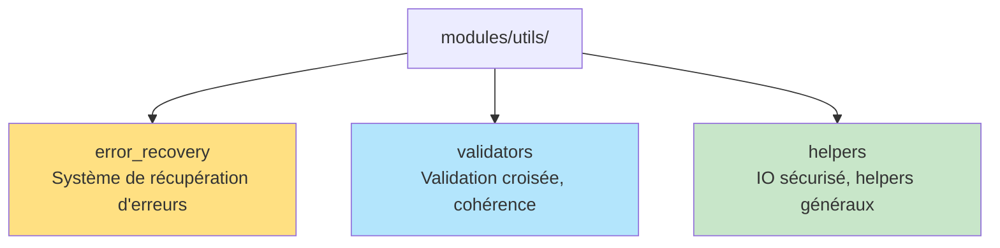

# 📦 Nouvelle structure du module `utils` consolidé

**Dernière mise à jour :** 2025-11-12  
**Statut :** Consolidation terminée ✅

## Schéma d'architecture



## Description des sous-modules

- **error_recovery/** : Système de récupération d'erreurs unifié, extensible (SOLID, patterns, métriques)
- **validators/** : Validation croisée des modules, cohérence, extensible via interfaces
- **helpers/** : Utilitaires généraux (écriture atomique, lecture sécurisée, helpers TOML/JSON)

> **Remarque :** Le module `taskia` reste un module principal indépendant (voir plus bas).

---

## Guide d'importation

```python
from modules.utils.error_recovery import ErrorRecoverySystem
from modules.utils.validators import CrossModuleValidator
from modules.utils.helpers import (
    atomic_write,
    locked_read,
    save_json_if_changed,  # ✅ Ajouté 2025-11-12
    save_toml_if_changed,  # ✅ Ajouté 2025-11-12
    load_toml_cached,       # ✅ Ajouté 2025-11-12
    save_json_safe,
    save_toml_safe,
    read_state_safe,
)
```

---

## Tableau de correspondance anciens/nouveaux modules

| Ancien module                        | Nouveau module/contenu                |
|--------------------------------------|---------------------------------------|
| modules/error_recovery/              | modules/utils/error_recovery/         |
| modules/zeroia/error_recovery_system | modules/utils/error_recovery/         |
| modules/crossmodule_validator/       | modules/utils/validators/             |
| utils/io_safe.py                     | modules/utils/helpers/                |
| modules/utils_enhanced/              | modules/utils/helpers/ (✅ **MIGRÉ** - 2025-11-12) |
| modules/taskia/                      | modules/taskia/ (reste principal)     |

**Note :** `modules/utils_enhanced/` a été complètement supprimé le 2025-11-12.  
Toutes les fonctionnalités ont été migrées vers `modules/utils/helpers/io_safe.py`.

---

## Points clés

- **Plus de doublon :** `taskia` n'est plus dans `utils/`, il reste un module principal indépendant.
- **Import unique et clair** pour tous les utilitaires consolidés.
- **Architecture SOLID** respectée et extensible.
- **Phase 1 du plan de consolidation :** ✅ Terminée et documentée.
- **Phase 2 (Standardisation I/O) :** ✅ Terminée 2025-11-12
  - `save_json_if_changed()` et `save_toml_if_changed()` fusionnées dans `io_safe.py`
  - Cache thread-safe pour `load_toml_cached()`
  - 5 fichiers migrés vers les fonctions standardisées

---

*Document généré automatiquement lors de la consolidation (juillet 2025)*  
*Dernière mise à jour : 2025-11-12 (Phase 2 terminée)*
