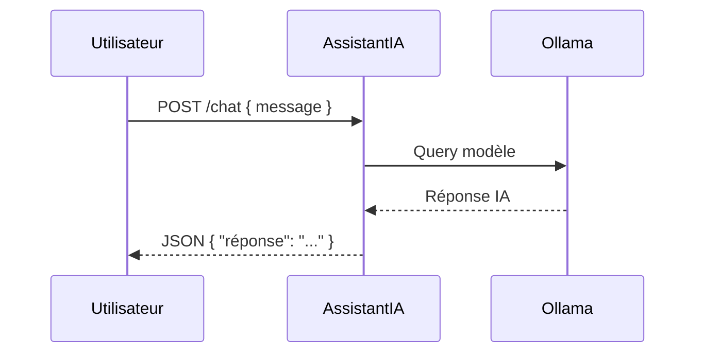

# 🧠 AssistantIA — Module Cognitif Intégré


Le module `assistantia/` est l’interface d’assistance IA locale d’Arkalia-LUNA. Il agit comme **guide conversationnel**, interface cognitive et **répondant intelligent** aux requêtes utilisateurs.

---

## 🧠 Rôle du module

- Dialogue IA avec l’utilisateur
- Réponses contextuelles personnalisées
- Interface évolutive vers l’IA autonome embarquée
- Support aux modules (Helloria, Reflexia…)
- Connexion à **Memoria** pour la mémoire à long terme (souvenirs vectoriels persistants)

---

## 🚀 Lancement manuel

```bash
uvicorn modules.assistantia.core:app --port 8001
```

📍 **Port configurable** dans `docker-compose.yml` ou `config/`.

---

## 🔄 Endpoints disponibles

| Méthode | URL           | Description                                      |
|---------|----------------|--------------------------------------------------|
| POST    | /api/v1/chat   | Envoie un message à l'IA locale                 |
| GET     | /status        | État du module assistantia                      |

---

## 🧪 Tests associés & CI/CD

- **Fichiers** :
  - `test_assistantia.py` (unitaires)
  - `test_assistantia_api_integration.py` (intégration API)
- **Pipeline CI/CD** :
  - 671 tests passés, 0 échec
  - Couverture globale : **59.25 %** (seuil requis 28 % largement dépassé)
  - Healthcheck Python natif intégré
  - Upload conditionnel des artefacts
  - CI/CD 100 % verte et stable (GitHub Actions)
  - Surveillance et conformité sécurité actives

✅ **Stabilité validée** : module compatible avec la pipeline CI/CD, tests automatisés, artefacts et logs surveillés.

---

## 🌐 Connectivité modulaire

Le module est connecté à :
- `helloria/` (API externe)
- `reflexia/` (monitoring et observabilité)
- `sandozia/` (intelligence croisée)
- `zeroia/` (moteur de décision)
- `cognitive_reactor/` (orchestrateur central)

💡 **Prêt pour une extension** vers Ollama, Langchain, ou des modèles hybrides.

---

🎯 **Objectif futur** : une IA embarquée réflexive, contextuelle, auto-ajustable.

---

## 🧠 AssistantIA — Utilisation, LLM & Mémoire Long Terme

L'AssistantIA est conçu pour offrir une interaction fluide et intelligente avec les utilisateurs, en intégrant des modèles de langage de pointe (LLM) pour comprendre et répondre aux requêtes de manière contextuelle.

---

## 🚀 Fonctionnalités Principales

- **Réponses Contextuelles** : Grâce à l'intégration de modèles LLM comme Mistral et Llama2, l'AssistantIA peut fournir des réponses précises et adaptées au contexte de la conversation.
- **Personnalisation** : L'AssistantIA s'adapte aux préférences de l'utilisateur, offrant une expérience personnalisée.
- **Intégration Facile** : Peut être intégré dans diverses applications via des API REST, facilitant l'interaction avec d'autres systèmes.
- **Mémoire Long Terme (Memoria)** : Enregistre les interactions et certains échanges marqués comme idées de projet ou décisions pour les réutiliser plus tard.

---

## 🌐 Exemple d'Utilisation

```bash
# Via AssistantIA directement (port 8001)
curl -X POST http://localhost:8001/api/v1/chat \
  -H "Content-Type: application/json" \
  -d '{"message": "Quelle est la philosophie d\"Arkalia ?", "user_id": "athalia"}'
```

---

## 🧠 Modèles LLM Intégrés

L'AssistantIA utilise des modèles LLM locaux pour garantir la confidentialité et l'efficacité. Les modèles sont stockés localement et peuvent être mis à jour ou remplacés selon les besoins.

---

## 📊 Structure JSON Entrante/Sortante (chat)

### Requête

```json
{
  "message": "Bonjour Arkalia",
  "model": "mistral:latest",
  "temperature": 0.7,
  "include_context": true,
  "user_id": "athalia"
}
```

### Réponse

```json
{
  "response": "Bonjour ! Je suis AssistantIA, prêt à vous aider.",
  "model_used": "mistral:latest",
  "processing_time": 0.42,
  "context_quality": 85.0,
  "arkalia_context": "ZeroIA: active | Reflexia: monitoring"
}
```

---

## ⚙️ Paramètres Optionnels & Mémoire

- **include_context** : Inclut le contexte Arkalia (ZeroIA, Reflexia, etc.) dans le prompt.
- **user_id** : Identifiant utilisateur ou de session pour lier la mémoire longue (Memoria).

### Activer la mémoire vectorielle (Memoria)

Dans l'environnement:

```bash
export MEMORIA_ENABLED=true
```

Optionnellement, pour utiliser un modèle d'embeddings Ollama:

```bash
export OLLAMA_EMBEDDING_MODEL=nomic-embed-text
```

---

## 📊 Schéma d'Interaction



---

🧠 *L'AssistantIA est votre partenaire intelligent pour une interaction IA enrichissante, sécurisée et conforme aux exigences CI/CD et sécurité d'Arkalia-LUNA Pro.*

Pour des considérations de sécurité, veuillez consulter [la section Sécurité](../security/security.md).

---

© 2025 **Athalia** – Tous droits réservés.
🤖 Powered by Arkalia Reflexia `v1.x`

# Documentation du Module Assistantia

## Introduction
Le module Assistantia est un composant clé du projet Arkalia-LUNA, conçu pour fournir des fonctionnalités avancées d'assistance et d'automatisation. Il joue un rôle crucial dans l'amélioration de l'efficacité opérationnelle et la réduction des erreurs humaines.

## Fonctionnalités
- **Automatisation des tâches** : Assistantia peut automatiser des tâches répétitives, libérant ainsi du temps pour des activités plus stratégiques.
- **Intégration transparente** : S'intègre facilement avec d'autres modules pour offrir une expérience utilisateur fluide.
- **Personnalisation** : Permet une personnalisation avancée pour répondre aux besoins spécifiques des utilisateurs.

## Configuration
Pour configurer le module Assistantia, modifiez le fichier `assistantia_config.toml` et ajustez les paramètres suivants :
- `enable_feature_x`: Active ou désactive la fonctionnalité X.
- `api_key`: Clé API nécessaire pour l'authentification.

## API
Le module expose plusieurs points d'entrée API :
- `GET /assistantia/status`: Retourne le statut actuel du module.
- `POST /assistantia/execute`: Exécute une commande spécifique.

## Dépannage
En cas de problème avec le module Assistantia, vérifiez les logs dans `logs/assistantia.log` pour des messages d'erreur détaillés. Assurez-vous que toutes les dépendances sont correctement installées.
