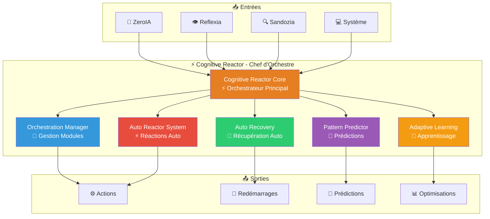

# ⚡ Cognitive Reactor — Orchestrateur central v2.8.0

> **Le chef d'orchestre d'Arkalia-LUNA** : Cognitive Reactor coordonne tous les modules, comme un chef d'orchestre qui synchronise tous les musiciens pour créer une symphonie parfaite.

## 🎯 Qu'est-ce que Cognitive Reactor ?

Cognitive Reactor est le **module d'orchestration avancée** du système. Il fonctionne comme le chef d'orchestre qui :

- 🎼 **Orchestre** : Coordination de tous les modules
- 🔄 **Récupère** : Redémarrage automatique en cas d'anomalie
- 🧠 **Apprend** : Apprentissage continu et prédictions
- ⚡ **Réagit** : Réactions automatiques intelligentes
- 📊 **Optimise** : Ajustement automatique des paramètres

## 🚀 Fonctionnalités Principales

### 🎼 Orchestration Avancée

Cognitive Reactor orchestre :

- **ZeroIA** : Coordination des décisions
- **Reflexia** : Synchronisation du monitoring
- **Sandozia** : Optimisation des analyses
- **Tous les modules** : Gestion globale

### 🔄 Auto-Récupération

- Redémarrage automatique des modules en cas d'anomalie
- Détection de pannes
- Récupération gracieuse
- Haute disponibilité garantie

### 🧠 Apprentissage Continu

- Analyse de patterns cognitifs
- Génération de prédictions
- Ajustement automatique des seuils
- Optimisation continue

### ⚡ Réactions Automatiques

- Réactions intelligentes aux problèmes
- Suggestions automatiques
- Alertes proactives
- Optimisations dynamiques

## 🔗 Intégrations

Cognitive Reactor fonctionne en **mode daemon** :

- Dialogue avec tous les modules critiques
- Interaction via **arkalia-api** (port 8000)
- Communication via fichiers d'état internes

## 📊 Métriques Exposées

Cognitive Reactor expose **4 métriques Prometheus** via arkalia-api :

- `cognitive_reactor_orchestrations_total`
- `cognitive_reactor_recoveries_total`
- `cognitive_reactor_predictions_total`
- `cognitive_reactor_reactions_total`

## 📈 Couverture Tests

- **45%** de couverture (à améliorer)
- Tests unitaires en cours
- Tests d'intégration validés

## 🎯 Cas d'Usage

- **Haute disponibilité** : Système toujours opérationnel
- **Résilience système** : Récupération automatique
- **Analyse proactive** : Détection préventive
- **Réactions cognitives automatiques** : Intelligence adaptative
- **Apprentissage continu** : Amélioration constante

## ✅ Statut Actuel

**Opérationnel** avec v2.8.0

---

*Dernière mise à jour : novembre 2025*
