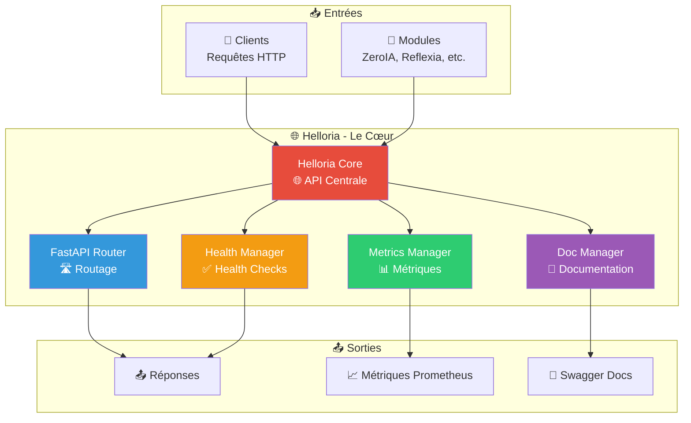

# 🌐 Helloria — API Centrale FastAPI v2.8.0

> **Le cœur d'Arkalia-LUNA** : Helloria est l'API centrale qui coordonne tous les modules, comme un hub central qui connecte tous les composants du système.

## 🎯 Qu'est-ce que Helloria ?

Helloria est le **module central de coordination cognitive** du système. Il fonctionne comme le cœur qui :
- 🌐 **Expose** : API REST complète avec FastAPI
- 🔗 **Connecte** : Point d'entrée pour tous les modules
- 📊 **Mesure** : Métriques Prometheus intégrées (34 métriques)
- ✅ **Vérifie** : Health endpoints automatiques
- ⚡ **Optimise** : Performance < 500ms



## 🚀 Fonctionnalités Principales

### 🌐 API REST Complète

Helloria expose une API REST complète avec FastAPI :
- **Performance optimisée** : < 500ms
- **Documentation automatique** : Swagger intégré
- **Validation automatique** : Types et schémas
- **Gestion d'erreurs** : Réponses structurées

### 📊 Métriques Prometheus

Helloria expose **34 métriques Prometheus** :
- Métriques système
- Métriques modules
- Métriques performance
- Métriques santé

### ✅ Health Checks

Health endpoints automatiques avec Python urllib natif :
- Vérification rapide
- Pas de dépendances externes
- Performance optimale

## Exemple de Requête
```python
import requests

response = requests.get("http://localhost:8000/")
print(response.json())
```

## Routes Exposées
- `GET /`: Retourne un message de bienvenue.
- `GET /status`: Retourne le statut opérationnel de Helloria.
- `GET /health`: Healthcheck optimisé avec Python urllib.
- `GET /metrics`: Métriques Prometheus (34 exposées).
- `GET /docs`: Documentation Swagger automatique.

## Métriques et Monitoring
- **34 métriques Prometheus** exposées
- **Healthcheck Python natif** (urllib.request)
- **Performance** < 500ms
- **Couverture tests** : 59.25% (global)

## Documentation Générale
Pour plus de détails, consultez la [documentation générale](https://arkalia-luna-system.github.io/arkalia-luna-pro/).

**Statut actuel** : ✅ Opérationnel avec FastAPI optimisé
