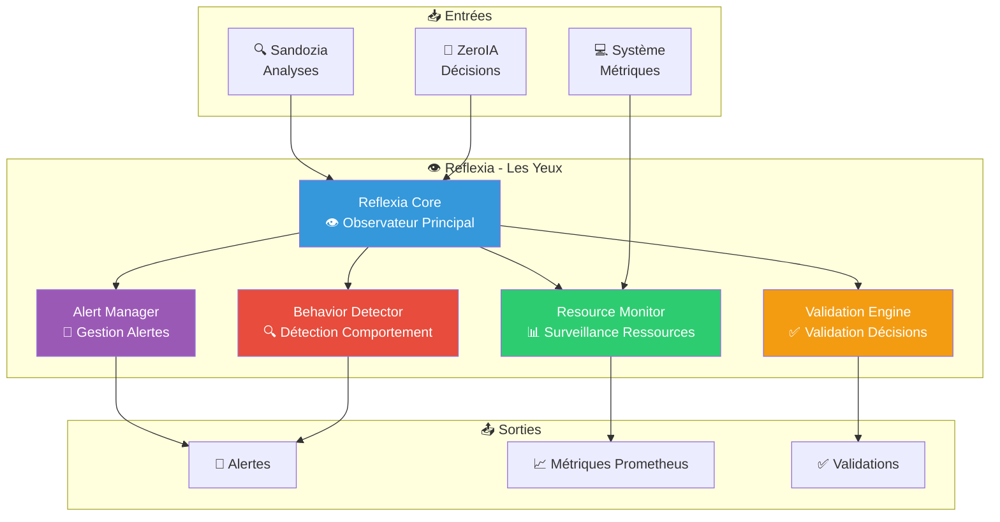

# 👁️ Reflexia — Observateur cognitif réflexif Enhanced v2.8.0

> **Les yeux d'Arkalia-LUNA** : Reflexia surveille tout le système en temps réel, comme un gardien vigilant qui détecte les problèmes avant qu'ils ne deviennent critiques.

## 🎯 Qu'est-ce que Reflexia ?

Reflexia est le **module de monitoring cognitif** du système. Il fonctionne comme les yeux qui :

- 👁️ **Surveillent** : Monitoring avancé des ressources (CPU, RAM, latence)
- 🔍 **Analysent** : Analyse comportementale des décisions
- ⚠️ **Alertent** : Détection d'anomalies et contradictions
- ✅ **Valident** : Validation des décisions ZeroIA
- 📊 **Mesurent** : Métriques Prometheus intégrées



## 🚀 Fonctionnalités Principales

### 📊 Monitoring Avancé

Reflexia surveille en temps réel :

- **CPU** : Utilisation processeur
- **RAM** : Consommation mémoire
- **Latence** : Temps de réponse
- **Containers** : Détection d'instabilité

### 🔍 Analyse Comportementale

- Détection de patterns anormaux
- Analyse des décisions ZeroIA
- Identification de contradictions
- Prédiction de problèmes

### ✅ Validation des Décisions

- Vérification de cohérence
- Validation inter-modules
- Détection de divergences
- Alertes automatiques

## 📡 API HTTP

Reflexia expose une API HTTP sur le port **8002** :

```bash
# Métriques Prometheus
curl http://localhost:8002/metrics

# Health check
curl http://localhost:8002/health

# Statut détaillé
curl http://localhost:8002/status
```

## 📊 Métriques Exposées

Reflexia expose **8 métriques Prometheus** :

- `reflexia_cpu_usage`
- `reflexia_ram_usage`
- `reflexia_latency_ms`
- `reflexia_alerts_total`
- `reflexia_validations_total`
- `reflexia_anomalies_detected`
- `reflexia_containers_healthy`
- `reflexia_decision_confidence`

## 🔗 Intégrations

- **ZeroIA** : Validation des décisions
- **Sandozia** : Analyse croisée
- **Prometheus** : Métriques temps réel
- **Grafana** : Dashboards visuels

## 📈 Couverture Tests

- **74%** de couverture (bon)
- Tests unitaires complets
- Tests d'intégration validés

## 🎯 Cas d'Usage

- **Supervision temps réel** : Monitoring continu
- **Détection d'anomalies** : Alertes automatiques
- **Intégration Prometheus/Grafana** : Observabilité complète
- **Analyse comportementale** : Patterns détectés
- **Validation des décisions** : Cohérence garantie

## ✅ Statut Actuel

**Opérationnel** avec Enhanced v2.8.0

---

*Dernière mise à jour : novembre 2025*
