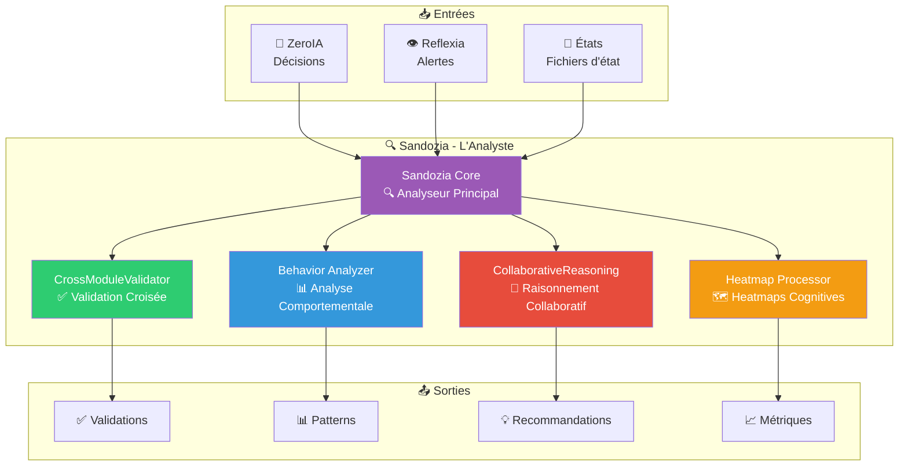

# 🔍 Sandozia — Intelligence croisée v2.8.0

> **L'analyste d'Arkalia-LUNA** : Sandozia analyse et valide les décisions de tous les modules, comme un expert qui vérifie la cohérence de tout le système.

## 🎯 Qu'est-ce que Sandozia ?

Sandozia est le **module d'intelligence croisée** du système. Il fonctionne comme l'analyste qui :
- 🔍 **Analyse** : Analyse avancée des états et décisions
- ✅ **Valide** : Validation de cohérence inter-modules
- 🤝 **Collabore** : Intelligence collaborative entre modules
- 📊 **Détecte** : Heatmaps cognitives et patterns
- 🎯 **Soutient** : Support à la prise de décision

## 🚀 Fonctionnalités Principales

### 🔍 Analyse Avancée

Sandozia analyse :
- **États système** : État de tous les modules
- **Décisions** : Historique des décisions ZeroIA
- **Patterns** : Détection de patterns cognitifs
- **Cohérence** : Validation inter-modules

### ✅ Validation Croisée

- Validation de cohérence entre ZeroIA et Reflexia
- Détection de divergences
- Vérification d'intégrité
- Alertes automatiques

### 🤝 Intelligence Collaborative

- Raisonnement collaboratif entre modules
- Consensus automatique
- Support décisionnel avancé
- Optimisation globale

### 📊 Heatmaps Cognitives

- Visualisation des patterns
- Détection de zones critiques
- Analyse temporelle
- Prédictions comportementales

## 🔗 Intégrations

Sandozia fonctionne en **mode daemon** (pas d'API HTTP publique) :
- Dialogue via fichiers d'état et events
- Métriques exposées via **arkalia-api** (port 8000)
- Interaction via fichiers d'état internes

## 📊 Métriques Exposées

Sandozia expose **6 métriques Prometheus** via arkalia-api :
- `sandozia_analyses_total`
- `sandozia_validations_total`
- `sandozia_patterns_detected`
- `sandozia_heatmaps_generated`
- `sandozia_collaborations_total`
- `sandozia_confidence_score`

## 📈 Couverture Tests

- **92%** de couverture (excellent)
- Tests unitaires complets
- Tests d'intégration validés
- Tests de validation croisée

## 🎯 Cas d'Usage

- **Analyse croisée** : Analyse multi-modules
- **Détection de divergences** : Validation cohérence
- **Support décisionnel** : Aide à la décision
- **Intelligence collaborative** : Raisonnement collectif
- **Analyse comportementale avancée** : Patterns complexes

## ✅ Statut Actuel

**Opérationnel** avec v2.8.0

---

*Dernière mise à jour : novembre 2025*
