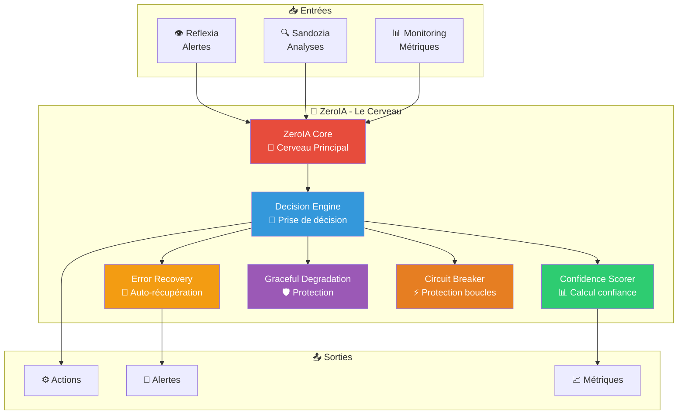
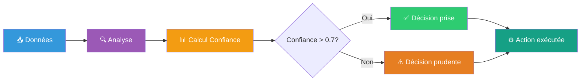
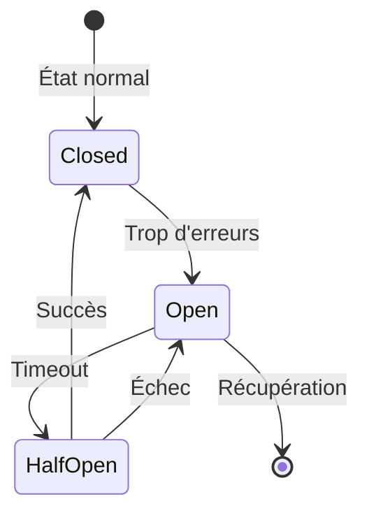
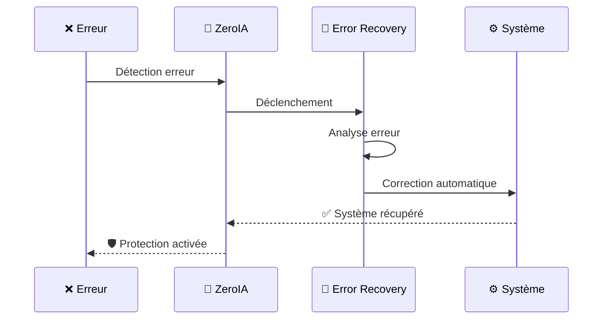

# 🧠 ZeroIA — Moteur de Décision Autonome Enhanced v2.8.0

> **Le cerveau d'Arkalia-LUNA** : ZeroIA prend des décisions intelligentes en temps réel, comme un chef d'orchestre qui coordonne tous les modules.

## 🎯 Qu'est-ce que ZeroIA ?

ZeroIA est le **moteur de décision autonome** du système. Il fonctionne comme le cerveau qui :
- 🧠 **Pense** : Analyse les situations et prend des décisions
- ⚡ **Réagit** : Agit rapidement en cas de problème
- 🛡️ **Protège** : Protège le système contre les erreurs
- 🔄 **Récupère** : Se remet automatiquement des erreurs



## 🚀 Fonctionnalités Principales

### 🎯 Prise de Décision Automatique

ZeroIA prend des décisions basées sur :
- 📊 **Confiance** : Score de confiance calculé
- 🔍 **Analyse** : Données de Reflexia et Sandozia
- 📈 **Historique** : Apprentissage des décisions passées
- ⚡ **Temps réel** : Réaction immédiate



### 🛡️ Circuit Breaker

Protection contre les boucles d'échec infinies :



### 🔄 Auto-Récupération (Error Recovery)

Le système se remet automatiquement des erreurs :



## 📊 Comment ça fonctionne ?

### 👨‍💻 Pour les Seniors

**Architecture technique** :
- Mode daemon (pas d'API HTTP directe)
- Communication via fichiers d'état et events
- 12 métriques Prometheus exposées
- Couverture tests : 87% (excellent)

**Intégration** :
- Interagit avec Reflexia (alertes)
- Interagit avec Sandozia (analyses)
- Expose métriques via arkalia-api (port 8000)

### 🎓 Pour les Débutants

**En termes simples** :
- ZeroIA est comme un **chef d'orchestre**
- Il **écoute** les autres modules (Reflexia, Sandozia)
- Il **décide** quoi faire
- Il **protège** le système contre les erreurs
- Il **récupère** automatiquement si quelque chose casse

**Exemple concret** :
```
1. Reflexia détecte : "CPU à 95% !"
2. ZeroIA analyse : "C'est dangereux"
3. ZeroIA décide : "Réduire la charge"
4. ZeroIA agit : "Désactiver services non-critiques"
5. Système : "✅ Protégé !"
```

## 🎯 Cas d'Usage

| Cas d'usage | Description | 👨‍💻 Senior | 🎓 Débutant |
|-------------|-------------|-------------|-------------|
| **Surveillance continue** | Monitoring 24/7 | Architecture résiliente | Système qui surveille tout |
| **Protection adaptative** | Circuit breaker | Protection contre pannes | Système qui se protège |
| **Décision rapide** | Réaction < 1s | Performance optimale | Réaction instantanée |
| **Auto-récupération** | Error Recovery | Résilience enterprise | Système qui se répare |
| **Dégradation gracieuse** | Services prioritaires | Architecture scalable | Système qui s'adapte |

## 📈 Métriques Exposées

ZeroIA expose **12 métriques Prometheus** :

- `zeroia_decisions_total` : Nombre total de décisions
- `zeroia_confidence_score` : Score de confiance moyen
- `zeroia_errors_total` : Nombre d'erreurs
- `zeroia_recovery_success_rate` : Taux de succès récupération
- ... et 8 autres métriques

> 💡 **Astuce** : Voir toutes les métriques sur http://localhost:9090/metrics

## 🔗 Accès

**Pas d'API HTTP publique directe** : Toute interaction passe par :
- 🚀 **arkalia-api** (port 8000) : Endpoint `/zeroia/status`
- 📊 **Prometheus** (port 9090) : Métriques
- 📝 **Fichiers d'état** : `state/zeroia_*.json`

---

**Statut actuel** : ✅ Opérationnel avec Error Recovery System v2.8.0
